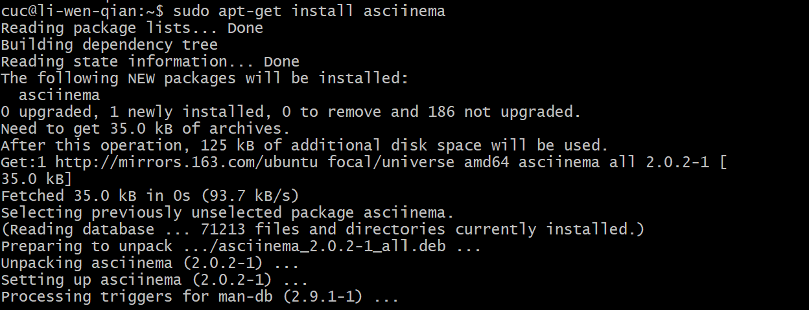
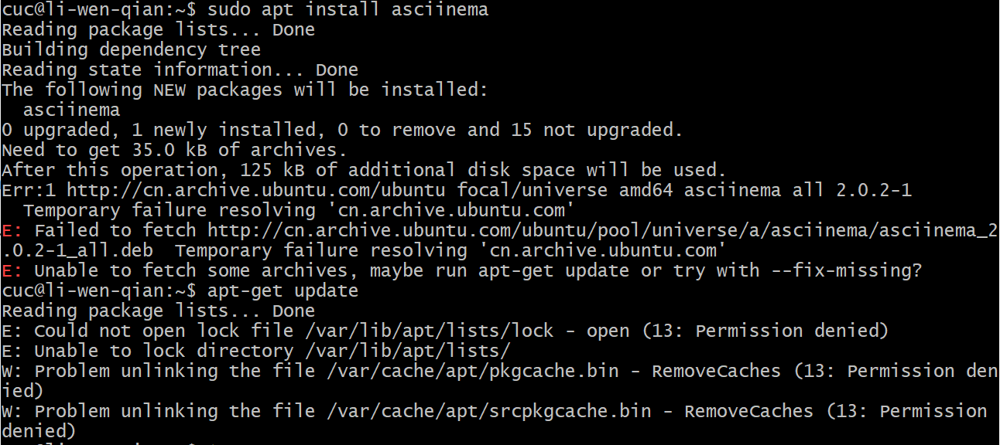
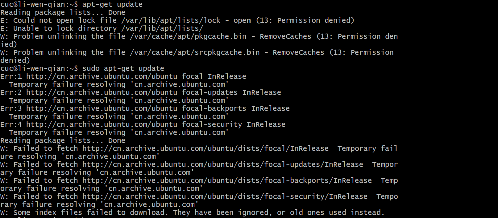
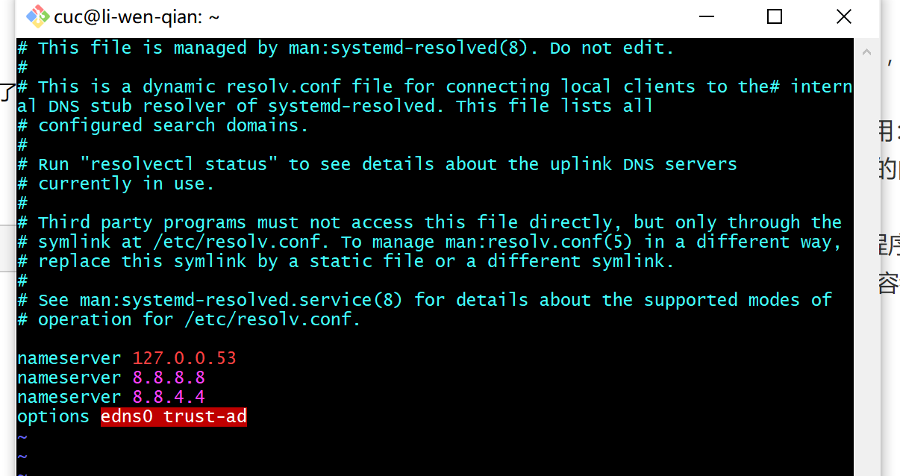
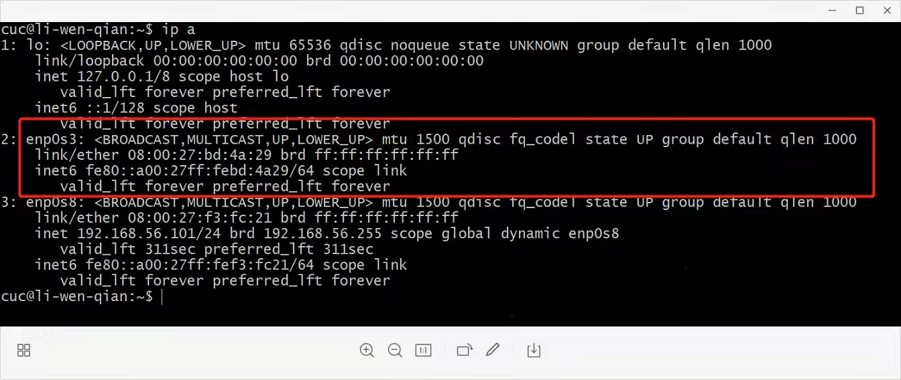

# 第二章（实验)

## 软件环境：

- 当前课程推荐的 Linux 发行版本
  - 本地环境（Ubuntu）
  - 云环境（CentOS）
  
- 在[asciinema](https://asciinema.org/)注册一个账号，并在本地安装配置好asciinema

  

- 确保本地已经完成**asciinema auth**，并在[asciinema](https://asciinema.org/)成功关联了本地账号和在线账号

- 在自己的github仓库上新建markdown格式纯文本文件附上asciinema的分享URL

- **提醒** 避免在终端操作录像过程中暴漏**密码、个人隐私**等任何机密数据

## 一、实验问题

使用表格方式记录至少 2 个不同 Linux 发行版本上以下信息的获取方法，使用 [asciinema](https://asciinema.org/) 录屏方式「分段」记录相关信息的获取过程和结果

【软件包管理】在目标发行版上安装 `tmux` 和 `tshark` ；查看这 2 个软件被安装到哪些路径；卸载 `tshark` ；验证 `tshark` 卸载结果

本地：[](https://asciinema.org/a/WO9bcrZYybx70Aer81GHD2qRt)

云环境：

[](https://asciinema.org/a/Z2KM7UJZ9eQMewberAN4S7LAY)


【文件管理】复制以下shell代码到终端运行，在目标 Linux 发行版系统中构造测试数据集，然后回答以下问题：

- 找到 `/tmp` 目录及其所有子目录下，文件名包含 `666` 的所有文件
- 找到 `/tmp` 目录及其所有子目录下，文件内容包含 `666` 的所有文件

```
cd /tmp && for i in $(seq 0 1024);do dir="test-$RANDOM";mkdir "$dir";echo "$RANDOM" > "$dir/$dir-$RANDOM";done
```

本地：

[](https://asciinema.org/a/IPulAdIdlaZLCjNSKkzYqJhkH)

云环境：

[](https://asciinema.org/a/GiD6KidD1YxVlXmBPyyCfXD2T)


【文件压缩与解压缩】练习课件中 [文件压缩与解压缩](https://c4pr1c3.github.io/LinuxSysAdmin/chap0x02.md.html#/12/1) 一节所有提到的压缩与解压缩命令的使用方法

- gzip
- bzip2
- zip
- ***tar\***
- 7z (p7zip)
- rar (p7zip-rar / unrar-free)
  - rar是私有压缩算法格式，Linux平台只支持解压缩

本地：

[](https://asciinema.org/a/hHBSfJRJbI6FLdnsGZ4GNNcHl)

云环境：

[](https://asciinema.org/a/m50iO6mH0xIYb4U3hzLdt8zgG)


# 目录管理

【跟练】 [子进程管理实验](https://asciinema.org/a/f3ux5ogwbxwo2q0wxxd0hmn54)

```
 ping www.baidu.com  
 ping www.baidu.com & 
 ifconfi64 bytes from 220.181.112.244
 64 bytes from 220.181.112.244: icmp_seq=4 ttl=63 time=105 ms
 64 bytes from 220.181.112.244: icmp_seq=8 ttl=63 time=105 ms        
 64 bytes from 220.181.112.244: icmp_seq=10 ttl=63 time=104 ms 
 64 bytes from 220.181.112.244: icmp_seq=11 ttl=63 time=103 ms       
 ping www.baidu.com 1>/dev/null 2>&1 & 
 uname -a  
 ps aux | grep ing  
 ping map.baidu.com 1>/dev/null 2>&1 &
 ps aux | grep ping   
 fg 
 ping map.baidu.com > /dev/null 2>&1 
 fg  
 ping www.baidu.com > /dev/null 2>&1
 ps aux | grep ping
 fg                                                        
 ping map.baidu.com > /dev/null 2>&1
 ps aux | grep ping                                           
 killall ping  
 ps aux | grep ping
 killall ping 
 kill^C  
 pstree -A    
 ps aux | grep ping
 kill 11792 
 ps aux | grep ping
 kill 11792 
 kill -9 11792  
 ps aux | grep ping
 ps aux | grep ping  
 exit

```

本地：

[](https://asciinema.org/a/KW24gnh4kpTXqWK2jiUwfZDJK)

云环境：


【硬件信息获取】目标系统的 CPU、内存大小、硬盘数量与硬盘容量

```
cat /proc/cpuinfo| grep "physical id"| sort| uniq| wc -l

 cat /proc/meminfo |grep MemTotal

fdisk -l |grep Disk
```

本地：

[](https://asciinema.org/a/QWsBGLjKjBPI2c9Wa3z6cunoj)

云环境：


## 二、遇到问题及解决。

##### 1.

先敲了指令sudo apt install asciinema

 apt-get update

sudo apt-get update一路报错





最后询问了师姐，师姐提供的方法是apt换元。

https://www.cnblogs.com/zqifa/p/12910989.html

**第一步：备份源文件：**
sudo cp /etc/apt/sources.list /etc/apt/sources.list.backup

**第二步：编辑/etc/apt/sources.list文件**

在文件最前面添加以下条目(操作前请做好相应备份)：
vi /etc/apt/sources.list

（ps.此处对Linux 下的 vi 基本状态的转换不太熟悉，去浏览了解了一下，详见问题2）

deb http://mirrors.aliyun.com/ubuntu/ focal main restricted universe multiverse
deb-src http://mirrors.aliyun.com/ubuntu/ focal main restricted universe multiverse
deb http://mirrors.aliyun.com/ubuntu/ focal-security main restricted universe multiverse
deb-src http://mirrors.aliyun.com/ubuntu/ focal-security main restricted universe multiverse
deb http://mirrors.aliyun.com/ubuntu/ focal-updates main restricted universe multiverse
deb-src http://mirrors.aliyun.com/ubuntu/ focal-updates main restricted universe multiverse
deb http://mirrors.aliyun.com/ubuntu/ focal-proposed main restricted universe multiverse
deb-src http://mirrors.aliyun.com/ubuntu/ focal-proposed main restricted universe multiverse
deb http://mirrors.aliyun.com/ubuntu/ focal-backports main restricted universe multiverse
deb-src http://mirrors.aliyun.com/ubuntu/ focal-backports main restricted universe multiverse



**第三步：执行更新命令：**

*sudo apt-get update
sudo apt-get upgrade*


#####  2.Linux 下的 vi 基本状态的转换如下：

（1）、vi /etc/apt/sources.list.d/gitlab-ce.list <cr>
此时把光标移动到你需要的位置，并且输入 i ，即可进入编辑状态（insert），此时你就可以在光标位置处插入新的内容了；
（2）、此时如果再按 ESC 键，就进入命令状态，输入如下命令有不同的作用：
     (i)、输入一个西文的冒号 : ，此时再输入西文的：w ，则把你刚才修改过的内容进行存盘并继续编辑；
    (ii)、输入一个西文的冒号 : ，此时再输入西文的：wq，存盘退出 vi 编辑程序；
   (iii)、输入一个西文的冒号 : ，此时再输入西文的： q!，刚才所有编辑的内容都不存盘，强制退出 vi 编辑程序！！！注：该命令一定要慎重使用！！！


##### 3.sudo apt-get update

以上方法尝试后但是还是无法实现sudo apt-get update。

就

```
ip a
```



发现连外网的网卡IP没了，网卡出了问题。

去看了虚拟机网络设置，发现问题改了设置，解决了问题。


##### 4.ssh 登录ubuntu时，报错failed to connect to http://changelogs.ubuntu.com/meta-release，can’t resolve…

了解了一下，可能是网络配置写错了，比如DNS写错了等，也可能是bug。

(1. 检查DNS

可以ping一下 `changelogs.ubuntu.com`
发现是正常的 

(2.删除缓存

```
sudo rm /var/lib/ubuntu-release-upgrader/release-upgrade-available
```

(3. 运行脚本，重新建立缓存

```
/etc/update-motd.d/91-release-upgrade
/usr/lib/ubuntu-release-upgrader/release-upgrade-motd
```

之后重启虚拟机，连接ssh就解决了。


##### 5.

**（1）vim有哪几种工作模式？**

vim有3种工作模式。

a.命令模式：

​    *打开文件首先进入命令模式，是使用vim编辑器的入口。

​    *在命令模式下，通过使用命令对文件进行常规的编辑操作，例如：复制、粘贴、删除、定位、翻页等等。

b.末行模式：

   *在末行模式下，执行退出文件、保存并退出文件等操作。

   *末行文件时vim编辑器的出口，要退出vim,必须要在末行模式下。

c.编辑模式：

​    *正常的编辑文字模式。

​    **（2）Normal模式下，从当前行开始，一次向下移动光标10行的操作方法？ 如何快速移动到文件开始行和结束行？如何快速跳转到文件的第N行？**

​     一次向下移动光标10行：10j

​     快速移动到文件开始行和结束行：gg表示移动到文本开头；G表示移动到文本结尾。

​     快速跳转到文件的第N行:   ：N（eg.    :111表示移动到第111行）

​    **（3）Normal模式下，如何删除单个字符、单个单词、从当前光标位置一直删除到行尾、单行、当前行开始往下数N行？**

​      删除单个字符、单个单词:dl 删除当前字符， dl=x

​     从当前光标位置一直删除到行尾:D 删除当前字符至行尾,D=d

​     从当前光标位置一直删除单行:dd 删除当前行

​     从当前光标位置一直删除当前行开始往下数N行:[N]dd 删除当前行开始的N行

   **（4）如何在vim中快速插入N个空行？如何在vim中快速输入80个？**

​    插入N个空行:  No

​    快速输入80个:80o

   **（5）如何撤销最近一次编辑操作？如何重做最近一次被撤销的操作？**

​     如何撤销最近一次编辑操作:u

​     如何重做最近一次被撤销的操作:ctr+r

   **（6）vim中如何实现剪切粘贴单个字符？单个单词？单行？如何实现相似的复制粘贴操作呢？**

剪切粘贴单个字符:  剪切：dh  粘贴：p

剪切粘贴单个单词：剪切:dw  粘贴：p

剪切粘贴单行：剪切：dd   粘贴：p

相似的复制粘贴操作：多行复制nyy

​      **(7)为了编辑一段文本你能想到哪几种操作方式（按键序列）?**

标记，插入，剪切、复制和粘贴，查找和替换。

​      (**8)查看当前正在编辑的文本名的方法？查看当前光标所在的行号的方法？**

在 etc/vim/vimrc中添加

set statusline+=%f

set laststatus=2 可以显示隐藏的状态栏

  （**9）在文件中进行关键词搜索你会用哪些方法？如何设置忽略大小写的情况下进行匹配搜索？如何将匹配的搜索结果进行高亮显示?如何对匹配到的关键词进行批量替换？**

关键词搜索方法：/text:查找text，按n健查找下一个，按N健查找前一个。?text:查找text，反向查找，按n健查找下一个，按N健查找前一个。

设置忽略大小写的情况下进行匹配搜索：:set ignorecase　　

将匹配的搜索结果进行高亮显示：:set hlsearch　

对匹配到的关键词进行批量替换：%s/old/new/g 用old替换new

**（10）在文件中最近编辑过的位置来回快速跳转的方法？**

跳转到上次修改的地方：``.`

**（11）如何把光标定位到各种括号的匹配项？例如：找到（，[,or{对应匹配的）,],or}**

1、把光标放在标记有（、[或{处。

2、按%字符

3、此时光标的位置应当在配对的括号处

4、再次按%就可以跳回配对的第一个括号处。

  **(12)在不退出vim的情况下执行一个外部程序的方法？**

:!cmd
不退出vim 执行命令 cmd

**（13）如何使用vim的内置帮助系统来查询一个内置默认快捷键的 使用方法？如何在两个不同的分屏窗口中移动光标？**

查询一个内置默认快捷键的 使用方法：用 :h quickref 可以看到分类整理的很多命令。

在两个不同的分屏窗口中移动光标：Ctr+w+w: 在多个窗口切换