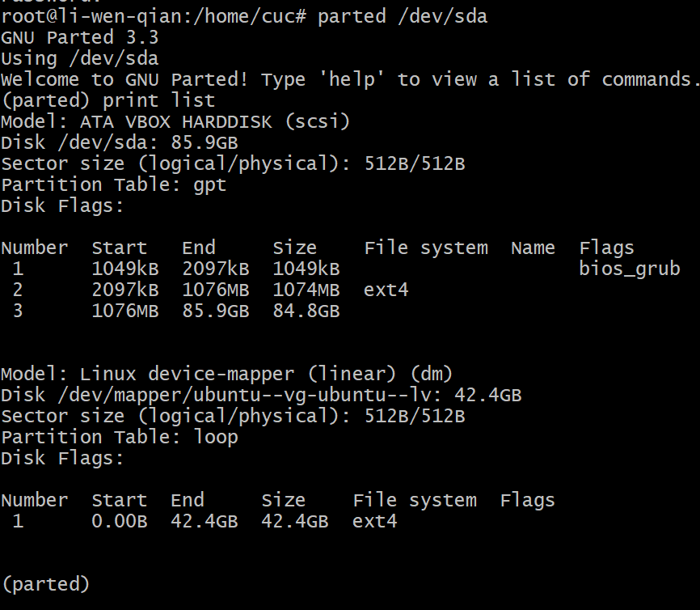

# 第三章

## 一、Systemd 实战。

**Systemd 入门教程（命令篇）：**

（1）由来（历史上，[Linux 的启动](https://www.ruanyifeng.com/blog/2013/08/linux_boot_process.html)一直采用[`init`](https://en.wikipedia.org/wiki/Init)进程）

下面的命令用来启动服务。

> ```bash
> $ service apache2 start
> ```

（2）Systemd 概述（使用了 Systemd，就不需要再用`init`了。Systemd 取代了`initd`，成为系统的第一个进程（PID 等于 1），其他进程都是它的子进程）

> ```bash
> $ systemctl --version
> ```

上面的命令查看 Systemd 的版本

（3）系统管理

​         3.1）systemctl（`systemctl`是 Systemd 的主命令，用于管理系统）

```bash
# 重启系统
$ sudo systemctl reboot

# 关闭系统，切断电源
$ sudo systemctl poweroff

# CPU停止工作
$ sudo systemctl halt

# 暂停系统
$ sudo systemctl suspend

# 让系统进入冬眠状态
$ sudo systemctl hibernate

# 让系统进入交互式休眠状态
$ sudo systemctl hybrid-sleep

# 启动进入救援状态（单用户状态）
$ sudo systemctl rescue
```

​         3.2）systemd-analyze（`systemd-analyze`命令用于查看启动耗时）

```bash
# 查看启动耗时
$ systemd-analyze                                                                                       

# 查看每个服务的启动耗时
$ systemd-analyze blame

# 显示瀑布状的启动过程流
$ systemd-analyze critical-chain

# 显示指定服务的启动流
$ systemd-analyze critical-chain atd.service
```

​        3.3） hostnamectl（`hostnamectl`命令用于查看当前主机的信息）

```bash
# 显示当前主机的信息
$ hostnamectl

# 设置主机名。
$ sudo hostnamectl set-hostname rhel7
```

​            3.4） localectl（`localectl`命令用于查看本地化设置）

> ```bash
> # 查看本地化设置
> $ localectl
> 
> # 设置本地化参数。
> $ sudo localectl set-locale LANG=en_GB.utf8
> $ sudo localectl set-keymap en_GB
> ```

​             3.5） timedatectl（`timedatectl`命令用于查看当前时区设置）

> ```bash
> # 查看当前时区设置
> $ timedatectl
> 
> # 显示所有可用的时区
> $ timedatectl list-timezones                                                                                   
> 
> # 设置当前时区
> $ sudo timedatectl set-timezone America/New_York
> $ sudo timedatectl set-time YYYY-MM-DD
> $ sudo timedatectl set-time HH:MM:SS
> ```

​             3.6） loginctl（`loginctl`命令用于查看当前登录的用户）

> ```bash
> # 列出当前session
> $ loginctl list-sessions
> 
> # 列出当前登录用户
> $ loginctl list-users
> 
> # 列出显示指定用户的信息
> $ loginctl show-user ruanyf
> ```

[](https://asciinema.org/a/SW205FCQFbijXXUxBaB5IX69T)

（4）Unit

​            4.1)`systemctl list-units`(可以查看当前系统的所有 Unit )

> ```bash
> # 列出正在运行的 Unit
> $ systemctl list-units
> 
> # 列出所有Unit，包括没有找到配置文件的或者启动失败的
> $ systemctl list-units --all
> 
> # 列出所有没有运行的 Unit
> $ systemctl list-units --all --state=inactive
> 
> # 列出所有加载失败的 Unit
> $ systemctl list-units --failed
> 
> # 列出所有正在运行的、类型为 service 的 Unit
> $ systemctl list-units --type=service
> ```

​            4.2) Unit 的状态(`systemctl status`命令用于查看系统状态和单个 Unit 的状态)

> ```bash
> # 显示系统状态
> $ systemctl status
> 
> # 显示单个 Unit 的状态
> $ sysystemctl status bluetooth.service
> 
> # 显示远程主机的某个 Unit 的状态
> $ systemctl -H root@rhel7.example.com status httpd.service
> ```

除了`status`命令，`systemctl`还提供了三个查询状态的简单方法，主要供脚本内部的判断语句使用。

> ```bash
> # 显示某个 Unit 是否正在运行
> $ systemctl is-active application.service
> 
> # 显示某个 Unit 是否处于启动失败状态
> $ systemctl is-failed application.service
> 
> # 显示某个 Unit 服务是否建立了启动链接
> $ systemctl is-enabled application.service
> ```

​           4.3) Unit 管理

对于用户来说，最常用的是下面这些命令，用于启动和停止 Unit（主要是 service）。

> ```bash
> # 立即启动一个服务
> $ sudo systemctl start apache.service
> 
> # 立即停止一个服务
> $ sudo systemctl stop apache.service
> 
> # 重启一个服务
> $ sudo systemctl restart apache.service
> 
> # 杀死一个服务的所有子进程
> $ sudo systemctl kill apache.service
> 
> # 重新加载一个服务的配置文件
> $ sudo systemctl reload apache.service
> 
> # 重载所有修改过的配置文件
> $ sudo systemctl daemon-reload
> 
> # 显示某个 Unit 的所有底层参数
> $ systemctl show httpd.service
> 
> # 显示某个 Unit 的指定属性的值
> $ systemctl show -p CPUShares httpd.service
> 
> # 设置某个 Unit 的指定属性
> $ sudo systemctl set-property httpd.service CPUShares=500
> ```

​            4.4) 依赖关系

Unit 之间存在依赖关系：A 依赖于 B，就意味着 Systemd 在启动 A 的时候，同时会去启动 B。

`systemctl list-dependencies`命令列出一个 Unit 的所有依赖。

> ```bash
> $ systemctl list-dependencies nginx.service
> ```

上面命令的输出结果之中，有些依赖是 Target 类型（详见下文），默认不会展开显示。如果要展开 Target，就需要使用`--all`参数。

> ```bash
> $ systemctl list-dependencies --all nginx.service
> ```


[](https://asciinema.org/a/EZmyZPHdCG8R4b6SLYGiQUIui)

(5)Unit 的配置

​     5.1） 概述（每一个 Unit 都有一个配置文件，告诉 Systemd 怎么启动这个 Unit 。）

Systemd 默认从目录`/etc/systemd/system/`读取配置文件。但是，里面存放的大部分文件都是符号链接，指向目录`/usr/lib/systemd/system/`，真正的配置文件存放在那个目录。

`systemctl enable`命令用于在上面两个目录之间，建立符号链接关系。

> ```bash
> $ sudo systemctl enable clamd@scan.service
> # 等同于
> $ sudo ln -s '/usr/lib/systemd/system/clamd@scan.service' '/etc/systemd/system/multi-user.target.wants/clamd@scan.service'
> ```

如果配置文件里面设置了开机启动，`systemctl enable`命令相当于激活开机启动。

与之对应的，`systemctl disable`命令用于在两个目录之间，撤销符号链接关系，相当于撤销开机启动。

> ```bash
> $ sudo systemctl disable clamd@scan.service
> ```

配置文件的后缀名，就是该 Unit 的种类，比如`sshd.socket`。如果省略，Systemd 默认后缀名为`.service`，所以`sshd`会被理解成`sshd.service`。

​           5.2） 配置文件的状态（`systemctl list-unit-files`命令用于列出所有配置文件）

> ```bash
> # 列出所有配置文件
> $ systemctl list-unit-files
> 
> # 列出指定类型的配置文件
> $ systemctl list-unit-files --type=service
> ```

这个命令会输出一个列表。

> ```bash
> $ systemctl list-unit-files
> 
> UNIT FILE              STATE
> chronyd.service        enabled
> clamd@.service         static
> clamd@scan.service     disabled
> ```

这个列表显示每个配置文件的状态，一共有四种。

> - enabled：已建立启动链接
> - disabled：没建立启动链接
> - static：该配置文件没有`[Install]`部分（无法执行），只能作为其他配置文件的依赖
> - masked：该配置文件被禁止建立启动链接

注意，从配置文件的状态无法看出，该 Unit 是否正在运行。这必须执行前面提到的`systemctl status`命令。

> ```bash
> $ systemctl status bluetooth.service
> ```

一旦修改配置文件，就要让 SystemD 重新加载配置文件，然后重新启动，否则修改不会生效。

> ```bash
> $ sudo systemctl daemon-reload
> $ sudo systemctl restart httpd.service
> ```

​          5.3） 配置文件的格式（配置文件就是普通的文本文件，可以用文本编辑器打开）

`systemctl cat`命令可以查看配置文件的内容。

> ```bash
> $ systemctl cat atd.service
> 
> [Unit]
> Description=ATD daemon
> 
> [Service]
> Type=forking
> ExecStart=/usr/bin/atd
> 
> [Install]
> WantedBy=multi-user.target
> ```

从上面的输出可以看到，配置文件分成几个区块。每个区块的第一行，是用方括号表示的区别名，比如`[Unit]`。注意，配置文件的区块名和字段名，都是大小写敏感的。

每个区块内部是一些等号连接的键值对。

> ```bash
> [Section]
> Directive1=value
> Directive2=value
> 
> . . .
> ```

注意，键值对的等号两侧不能有空格。

​              5.4） 配置文件的区块

`[Unit]`区块通常是配置文件的第一个区块，用来定义 Unit 的元数据，以及配置与其他 Unit 的关系。它的主要字段如下。

> - `Description`：简短描述
> - `Documentation`：文档地址
> - `Requires`：当前 Unit 依赖的其他 Unit，如果它们没有运行，当前 Unit 会启动失败
> - `Wants`：与当前 Unit 配合的其他 Unit，如果它们没有运行，当前 Unit 不会启动失败
> - `BindsTo`：与`Requires`类似，它指定的 Unit 如果退出，会导致当前 Unit 停止运行
> - `Before`：如果该字段指定的 Unit 也要启动，那么必须在当前 Unit 之后启动
> - `After`：如果该字段指定的 Unit 也要启动，那么必须在当前 Unit 之前启动
> - `Conflicts`：这里指定的 Unit 不能与当前 Unit 同时运行
> - `Condition...`：当前 Unit 运行必须满足的条件，否则不会运行
> - `Assert...`：当前 Unit 运行必须满足的条件，否则会报启动失败

`[Install]`通常是配置文件的最后一个区块，用来定义如何启动，以及是否开机启动。它的主要字段如下。

> - `WantedBy`：它的值是一个或多个 Target，当前 Unit 激活时（enable）符号链接会放入`/etc/systemd/system`目录下面以 Target 名 + `.wants`后缀构成的子目录中
> - `RequiredBy`：它的值是一个或多个 Target，当前 Unit 激活时，符号链接会放入`/etc/systemd/system`目录下面以 Target 名 + `.required`后缀构成的子目录中
> - `Alias`：当前 Unit 可用于启动的别名
> - `Also`：当前 Unit 激活（enable）时，会被同时激活的其他 Unit

`[Service]`区块用来 Service 的配置，只有 Service 类型的 Unit 才有这个区块。它的主要字段如下。

> - `Type`：定义启动时的进程行为。它有以下几种值。
> - `Type=simple`：默认值，执行`ExecStart`指定的命令，启动主进程
> - `Type=forking`：以 fork 方式从父进程创建子进程，创建后父进程会立即退出
> - `Type=oneshot`：一次性进程，Systemd 会等当前服务退出，再继续往下执行
> - `Type=dbus`：当前服务通过D-Bus启动
> - `Type=notify`：当前服务启动完毕，会通知`Systemd`，再继续往下执行
> - `Type=idle`：若有其他任务执行完毕，当前服务才会运行
> - `ExecStart`：启动当前服务的命令
> - `ExecStartPre`：启动当前服务之前执行的命令
> - `ExecStartPost`：启动当前服务之后执行的命令
> - `ExecReload`：重启当前服务时执行的命令
> - `ExecStop`：停止当前服务时执行的命令
> - `ExecStopPost`：停止当其服务之后执行的命令
> - `RestartSec`：自动重启当前服务间隔的秒数
> - `Restart`：定义何种情况 Systemd 会自动重启当前服务，可能的值包括`always`（总是重启）、`on-success`、`on-failure`、`on-abnormal`、`on-abort`、`on-watchdog`
> - `TimeoutSec`：定义 Systemd 停止当前服务之前等待的秒数
> - `Environment`：指定环境变量

Unit 配置文件的完整字段清单，请参考[官方文档](https://www.freedesktop.org/software/systemd/man/systemd.unit.html)。

（6）Target

```bash
# 查看当前系统的所有 Target
$ systemctl list-unit-files --type=target

# 查看一个 Target 包含的所有 Unit
$ systemctl list-dependencies multi-user.target

# 查看启动时的默认 Target
$ systemctl get-default

# 设置启动时的默认 Target
$ sudo systemctl set-default multi-user.target

# 切换 Target 时，默认不关闭前一个 Target 启动的进程，
# systemctl isolate 命令改变这种行为，
# 关闭前一个 Target 里面所有不属于后一个 Target 的进程
$ sudo systemctl isolate multi-user.target
```

[](https://asciinema.org/a/CHqwS1Y3ZxiiN3rZrtT1xcDHc)


(7)日志管理（Systemd 统一管理所有 Unit 的启动日志。带来的好处就是，可以只用`journalctl`一个命令，查看所有日志（内核日志和应用日志）。日志的配置文件是`/etc/systemd/journald.conf`。

`journalctl`功能强大，用法非常多。）

```bash
# 查看所有日志（默认情况下 ，只保存本次启动的日志）
$ sudo journalctl

# 查看内核日志（不显示应用日志）
$ sudo journalctl -k

# 查看系统本次启动的日志
$ sudo journalctl -b
$ sudo journalctl -b -0

# 查看上一次启动的日志（需更改设置）
$ sudo journalctl -b -1

# 查看指定时间的日志
$ sudo journalctl --since="2012-10-30 18:17:16"
$ sudo journalctl --since "20 min ago"
$ sudo journalctl --since yesterday
$ sudo journalctl --since "2015-01-10" --until "2015-01-11 03:00"
$ sudo journalctl --since 09:00 --until "1 hour ago"

# 显示尾部的最新10行日志
$ sudo journalctl -n

# 显示尾部指定行数的日志
$ sudo journalctl -n 20

# 实时滚动显示最新日志
$ sudo journalctl -f

# 查看指定服务的日志
$ sudo journalctl /usr/lib/systemd/systemd

# 查看指定进程的日志
$ sudo journalctl _PID=1

# 查看某个路径的脚本的日志
$ sudo journalctl /usr/bin/bash

# 查看指定用户的日志
$ sudo journalctl _UID=33 --since today

# 查看某个 Unit 的日志
$ sudo journalctl -u nginx.service
$ sudo journalctl -u nginx.service --since today

# 实时滚动显示某个 Unit 的最新日志
$ sudo journalctl -u nginx.service -f

# 合并显示多个 Unit 的日志
$ journalctl -u nginx.service -u php-fpm.service --since today

# 查看指定优先级（及其以上级别）的日志，共有8级
# 0: emerg
# 1: alert
# 2: crit
# 3: err
# 4: warning
# 5: notice
# 6: info
# 7: debug
$ sudo journalctl -p err -b

# 日志默认分页输出，--no-pager 改为正常的标准输出
$ sudo journalctl --no-pager

# 以 JSON 格式（单行）输出
$ sudo journalctl -b -u nginx.service -o json

# 以 JSON 格式（多行）输出，可读性更好
$ sudo journalctl -b -u nginx.serviceqq
 -o json-pretty

# 显示日志占据的硬盘空间
$ sudo journalctl --disk-usage

# 指定日志文件占据的最大空间
$ sudo journalctl --vacuum-size=1G

# 指定日志文件保存多久
$ sudo journalctl --vacuum-time=1years
```

[](https://asciinema.org/a/OUlzkvKGEBtxeA9xDMQvalJiV)


**Systemd 入门教程（实战篇）：**

**（1）开机启动**

对于那些支持 Systemd 的软件，安装的时候，会自动在`/usr/lib/systemd/system`目录添加一个配置文件。

如果你想让该软件开机启动，就执行下面的命令（以`httpd.service`为例）。

> ```bash
> $ sudo systemctl enable httpd
> ```

上面的命令相当于在`/etc/systemd/system`目录添加一个符号链接，指向`/usr/lib/systemd/system`里面的`httpd.service`文件。

这是因为开机时，`Systemd`只执行`/etc/systemd/system`目录里面的配置文件。这也意味着，如果把修改后的配置文件放在该目录，就可以达到覆盖原始配置的效果。

**（2）启动服务**

设置开机启动以后，软件并不会立即启动，必须等到下一次开机。如果想现在就运行该软件，那么要执行`systemctl start`命令。

> ```bash
> $ sudo systemctl start httpd
> ```

执行上面的命令以后，有可能启动失败，因此要用`systemctl status`命令查看一下该服务的状态。

> ```bash
> $ sudo systemctl status httpd
> 
> httpd.service - The Apache HTTP Server
>    Loaded: loaded (/usr/lib/systemd/system/httpd.service; enabled)
>    Active: active (running) since 金 2014-12-05 12:18:22 JST; 7min ago
>  Main PID: 4349 (httpd)
>    Status: "Total requests: 1; Current requests/sec: 0; Current traffic:   0 B/sec"
>    CGroup: /system.slice/httpd.service
>            ├─4349 /usr/sbin/httpd -DFOREGROUND
>            ├─4350 /usr/sbin/httpd -DFOREGROUND
>            ├─4351 /usr/sbin/httpd -DFOREGROUND
>            ├─4352 /usr/sbin/httpd -DFOREGROUND
>            ├─4353 /usr/sbin/httpd -DFOREGROUND
>            └─4354 /usr/sbin/httpd -DFOREGROUND
> 
> 12月 05 12:18:22 localhost.localdomain systemd[1]: Starting The Apache HTTP Server...
> 12月 05 12:18:22 localhost.localdomain systemd[1]: Started The Apache HTTP Server.
> 12月 05 12:22:40 localhost.localdomain systemd[1]: Started The Apache HTTP Server.
> ```

上面的输出结果含义如下。

> - `Loaded`行：配置文件的位置，是否设为开机启动
> - `Active`行：表示正在运行
> - `Main PID`行：主进程ID
> - `Status`行：由应用本身（这里是 httpd ）提供的软件当前状态
> - `CGroup`块：应用的所有子进程
> - 日志块：应用的日志

**（3）停止服务**

终止正在运行的服务，需要执行`systemctl stop`命令。

> ```bash
> $ sudo systemctl stop httpd.service
> ```

有时候，该命令可能没有响应，服务停不下来。这时候就不得不"杀进程"了，向正在运行的进程发出`kill`信号。

> ```bash
> $ sudo systemctl kill httpd.service
> ```

此外，重启服务要执行`systemctl restart`命令。

> ```bash
> $ sudo systemctl restart httpd.service
> ```

（4）读懂配置文件

一个服务怎么启动，完全由它的配置文件决定。下面就来看，配置文件有些什么内容。

前面说过，配置文件主要放在`/usr/lib/systemd/system`目录，也可能在`/etc/systemd/system`目录。找到配置文件以后，使用文本编辑器打开即可。

`systemctl cat`命令可以用来查看配置文件，下面以`sshd.service`文件为例，它的作用是启动一个 SSH 服务器，供其他用户以 SSH 方式登录。

> ```bash
> $ systemctl cat sshd.service
> 
> [Unit]
> Description=OpenSSH server daemon
> Documentation=man:sshd(8) man:sshd_config(5)
> After=network.target sshd-keygen.service
> Wants=sshd-keygen.service
> 
> [Service]
> EnvironmentFile=/etc/sysconfig/sshd
> ExecStart=/usr/sbin/sshd -D $OPTIONS
> ExecReload=/bin/kill -HUP $MAINPID
> Type=simple
> KillMode=process
> Restart=on-failure
> RestartSec=42s
> 
> [Install]
> WantedBy=multi-user.target
> ```

可以看到，配置文件分成几个区块，每个区块包含若干条键值对。

下面依次解释每个区块的内容。

**（5） [Unit] 区块：启动顺序与依赖关系。**

`Unit`区块的`Description`字段给出当前服务的简单描述，`Documentation`字段给出文档位置。

接下来的设置是启动顺序和依赖关系，这个比较重要。

> `After`字段：表示如果`network.target`或`sshd-keygen.service`需要启动，那么`sshd.service`应该在它们之后启动。

相应地，还有一个`Before`字段，定义`sshd.service`应该在哪些服务之前启动。

注意，`After`和`Before`字段只涉及启动顺序，不涉及依赖关系。

举例来说，某 Web 应用需要 postgresql 数据库储存数据。在配置文件中，它只定义要在 postgresql 之后启动，而没有定义依赖 postgresql 。上线后，由于某种原因，postgresql 需要重新启动，在停止服务期间，该 Web 应用就会无法建立数据库连接。

设置依赖关系，需要使用`Wants`字段和`Requires`字段。

> `Wants`字段：表示`sshd.service`与`sshd-keygen.service`之间存在"弱依赖"关系，即如果"sshd-keygen.service"启动失败或停止运行，不影响`sshd.service`继续执行。

`Requires`字段则表示"强依赖"关系，即如果该服务启动失败或异常退出，那么`sshd.service`也必须退出。

注意，`Wants`字段与`Requires`字段只涉及依赖关系，与启动顺序无关，默认情况下是同时启动的。

**（6）[Service] 区块：启动行为**

`Service`区块定义如何启动当前服务。

**6.1） 启动命令**

许多软件都有自己的环境参数文件，该文件可以用`EnvironmentFile`字段读取。

> `EnvironmentFile`字段：指定当前服务的环境参数文件。该文件内部的`key=value`键值对，可以用`$key`的形式，在当前配置文件中获取。

上面的例子中，sshd 的环境参数文件是`/etc/sysconfig/sshd`。

配置文件里面最重要的字段是`ExecStart`。

> `ExecStart`字段：定义启动进程时执行的命令。

上面的例子中，启动`sshd`，执行的命令是`/usr/sbin/sshd -D $OPTIONS`，其中的变量`$OPTIONS`就来自`EnvironmentFile`字段指定的环境参数文件。

与之作用相似的，还有如下这些字段。

> - `ExecReload`字段：重启服务时执行的命令
> - `ExecStop`字段：停止服务时执行的命令
> - `ExecStartPre`字段：启动服务之前执行的命令
> - `ExecStartPost`字段：启动服务之后执行的命令
> - `ExecStopPost`字段：停止服务之后执行的命令

请看下面的例子。

> ```bash
> [Service]
> ExecStart=/bin/echo execstart1
> ExecStart=
> ExecStart=/bin/echo execstart2
> ExecStartPost=/bin/echo post1
> ExecStartPost=/bin/echo post2
> ```

上面这个配置文件，第二行`ExecStart`设为空值，等于取消了第一行的设置，运行结果如下。

> ```bash
> execstart2
> post1
> post2
> ```

所有的启动设置之前，都可以加上一个连词号（`-`），表示"抑制错误"，即发生错误的时候，不影响其他命令的执行。比如，`EnvironmentFile=-/etc/sysconfig/sshd`（注意等号后面的那个连词号），就表示即使`/etc/sysconfig/sshd`文件不存在，也不会抛出错误。

**6.2） 启动类型**

`Type`字段定义启动类型。它可以设置的值如下。

> - simple（默认值）：`ExecStart`字段启动的进程为主进程
> - forking：`ExecStart`字段将以`fork()`方式启动，此时父进程将会退出，子进程将成为主进程
> - oneshot：类似于`simple`，但只执行一次，Systemd 会等它执行完，才启动其他服务
> - dbus：类似于`simple`，但会等待 D-Bus 信号后启动
> - notify：类似于`simple`，启动结束后会发出通知信号，然后 Systemd 再启动其他服务
> - idle：类似于`simple`，但是要等到其他任务都执行完，才会启动该服务。一种使用场合是为让该服务的输出，不与其他服务的输出相混合

下面是一个`oneshot`的例子，笔记本电脑启动时，要把触摸板关掉，配置文件可以这样写。

> ```bash
> [Unit]
> Description=Switch-off Touchpad
> 
> [Service]
> Type=oneshot
> ExecStart=/usr/bin/touchpad-off
> 
> [Install]
> WantedBy=multi-user.target
> ```

上面的配置文件，启动类型设为`oneshot`，就表明这个服务只要运行一次就够了，不需要长期运行。

如果关闭以后，将来某个时候还想打开，配置文件修改如下。

> ```bash
> [Unit]
> Description=Switch-off Touchpad
> 
> [Service]
> Type=oneshot
> ExecStart=/usr/bin/touchpad-off start
> ExecStop=/usr/bin/touchpad-off stop
> RemainAfterExit=yes
> 
> [Install]
> WantedBy=multi-user.target
> ```

上面配置文件中，`RemainAfterExit`字段设为`yes`，表示进程退出以后，服务仍然保持执行。这样的话，一旦使用`systemctl stop`命令停止服务，`ExecStop`指定的命令就会执行，从而重新开启触摸板。

**6.3） 重启行为**

`Service`区块有一些字段，定义了重启行为。

> `KillMode`字段：定义 Systemd 如何停止 sshd 服务。

上面这个例子中，将`KillMode`设为`process`，表示只停止主进程，不停止任何sshd 子进程，即子进程打开的 SSH session 仍然保持连接。这个设置不太常见，但对 sshd 很重要，否则你停止服务的时候，会连自己打开的 SSH session 一起杀掉。

`KillMode`字段可以设置的值如下。

> - control-group（默认值）：当前控制组里面的所有子进程，都会被杀掉
> - process：只杀主进程
> - mixed：主进程将收到 SIGTERM 信号，子进程收到 SIGKILL 信号
> - none：没有进程会被杀掉，只是执行服务的 stop 命令。

接下来是`Restart`字段。

> `Restart`字段：定义了 sshd 退出后，Systemd 的重启方式。

上面的例子中，`Restart`设为`on-failure`，表示任何意外的失败，就将重启sshd。如果 sshd 正常停止（比如执行`systemctl stop`命令），它就不会重启。

`Restart`字段可以设置的值如下。

> - no（默认值）：退出后不会重启
> - on-success：只有正常退出时（退出状态码为0），才会重启
> - on-failure：非正常退出时（退出状态码非0），包括被信号终止和超时，才会重启
> - on-abnormal：只有被信号终止和超时，才会重启
> - on-abort：只有在收到没有捕捉到的信号终止时，才会重启
> - on-watchdog：超时退出，才会重启
> - always：不管是什么退出原因，总是重启

对于守护进程，推荐设为`on-failure`。对于那些允许发生错误退出的服务，可以设为`on-abnormal`。

最后是`RestartSec`字段。

> `RestartSec`字段：表示 Systemd 重启服务之前，需要等待的秒数。上面的例子设为等待42秒。

**（7）[Install] 区块**

`Install`区块，定义如何安装这个配置文件，即怎样做到开机启动。

> `WantedBy`字段：表示该服务所在的 Target。

`Target`的含义是服务组，表示一组服务。`WantedBy=multi-user.target`指的是，sshd 所在的 Target 是`multi-user.target`。

这个设置非常重要，因为执行`systemctl enable sshd.service`命令时，`sshd.service`的一个符号链接，就会放在`/etc/systemd/system`目录下面的`multi-user.target.wants`子目录之中。

Systemd 有默认的启动 Target。

> ```bash
> $ systemctl get-default
> multi-user.target
> ```

上面的结果表示，默认的启动 Target 是`multi-user.target`。在这个组里的所有服务，都将开机启动。这就是为什么`systemctl enable`命令能设置开机启动的原因。

使用 Target 的时候，`systemctl list-dependencies`命令和`systemctl isolate`命令也很有用。

> ```bash
> # 查看 multi-user.target 包含的所有服务
> $ systemctl list-dependencies multi-user.target
> 
> # 切换到另一个 target
> # shutdown.target 就是关机状态
> $ sudo systemctl isolate shutdown.target
> ```

一般来说，常用的 Target 有两个：一个是`multi-user.target`，表示多用户命令行状态；另一个是`graphical.target`，表示图形用户状态，它依赖于`multi-user.target`。官方文档有一张非常清晰的 [Target 依赖关系图](https://www.freedesktop.org/software/systemd/man/bootup.html#System Manager Bootup)。

[](https://asciinema.org/a/4Q49XP1SOLVzaOfRkv9Cu8fXT)

**（8）Target 的配置文件**

Target 也有自己的配置文件。

> ```bash
> $ systemctl cat multi-user.target
> 
> [Unit]
> Description=Multi-User System
> Documentation=man:systemd.special(7)
> Requires=basic.target
> Conflicts=rescue.service rescue.target
> After=basic.target rescue.service rescue.target
> AllowIsolate=yes
> ```

注意，Target 配置文件里面没有启动命令。

上面输出结果中，主要字段含义如下。

> `Requires`字段：要求`basic.target`一起运行。
>
> `Conflicts`字段：冲突字段。如果`rescue.service`或`rescue.target`正在运行，`multi-user.target`就不能运行，反之亦然。
>
> `After`：表示`multi-user.target`在`basic.target` 、 `rescue.service`、 `rescue.target`之后启动，如果它们有启动的话。
>
> `AllowIsolate`：允许使用`systemctl isolate`命令切换到`multi-user.target`。

**（9）修改配置文件后重启**

修改配置文件以后，需要重新加载配置文件，然后重新启动相关服务。

> ```bash
> # 重新加载配置文件
> $ sudo systemctl daemon-reload
> 
> # 重启相关服务
> $ sudo systemctl restart foobar
> ```


[](https://asciinema.org/a/TDj34MgFSxW5bGbrwtUWPfrub)


## 二、自查清单

### 如何添加一个用户并使其具备sudo执行程序的权限？

1、添加新用户

```
adduser lwq-text
```

2、设置密码

```
passwd lwq-text
```

根据提示输入3次密码

在使用`sudo`命令的时候，会提示：

```
sudo:must be setuid root 错误
```

就是无法使用`sudo`命令，解决方法：

使用`su` ，进入`root`用户下，执行：

```
chown root:root /usr/bin/sudo

chmod 4755 /usr/bin/sudo
```

再次使用`sudo`命令，发现提示：

```
lwq-text is not in the sudoers file. This incident will be reported.
```

说明`lwq-text`还是没有权限使用`sudo`，解决方法：

1）输入`su`，进入`root`模式。

2）添加写文件权限：

```
chmod u+w /etc/sudoers
```

3）编辑文件 `/etc/sudoers`，

```
vim /etc/sudoers
```

找到"`root ALL=(ALL) ALL`"这行，在下面添加：

```
lwq-text ALL=(ALL) ALL
```

4）撤销写文件权限：

```
chmod u-w /etc/sudoers
```


### 如何将一个用户添加到一个用户组？

##### 方法 1：使用 `usermod` 命令

`usermod` 命令修改系统帐户文件，以反映命令行上指定的更改。

**如何使用 `usermod` 命令将现有的用户添加到次要组或附加组？** 

要将现有用户添加到辅助组，请使用带有 `-G` 选项和组名称的 `usermod` 命令。

语法：

```
# usermod [-G] [GroupName] [UserName]
```

如果系统中不存在给定的用户或组，你将收到一条错误消息。如果没有得到任何错误，那么用户已经被添加到相应的组中。

```
# usermod -a -G mygroup user1
```

使用 `id` 命令查看输出。

```
# id user1
uid=1008(user1) gid=1008(user1) groups=1008(user1),1012(mygroup)
```

**如何使用 usermod 命令将现有的用户添加到多个次要组或附加组？**

要将现有用户添加到多个次要组中，使用带有 `-G` 选项的 `usermod` 命令和带有逗号分隔的组名称。

语法：

```
# usermod [-G] [GroupName1,GroupName2] [UserName]
```

把 `user2` 添加到 `mygroup` 和 `mygroup1` 中。

```
# usermod -a -G mygroup,mygroup1 user2
```

使用 `id` 命令查看输出。`user2` 已成功添加到 `myGroup` 和 `myGroup1` 中。

```
# id user2
uid=1009(user2) gid=1009(user2)
groups=1009(user2),1012(mygroup),1013(mygroup1)
```

**如何改变用户的主要组？**

要更改用户的主要组，使用带有 `-g` 选项和组名称的 `usermod` 命令。

语法：

```
# usermod [-g] [GroupName] [UserName]
```

必须使用 `-g` 改变用户的主要组。

```
# usermod -g mygroup user3
```

查看输出，已成功更改。显示`user3` 主要组是 `mygroup` 而不是 `user3`。

```
# id user3
uid=1010(user3) gid=1012(mygroup) groups=1012(mygroup)
```


##### 方法 2：使用 gpasswd 命令

`gpasswd` 命令用于管理 `/etc/group` 和 `/etc/gshadow`。每个组都可以有管理员、成员和密码。

**如何使用 gpasswd 命令将现有用户添加到次要组或者附加组？**

要将现有用户添加到次要组，请使用带有 `-M` 选项和组名称的 `gpasswd` 命令。

语法：

```
gpasswd [-M] [UserName] [GroupName]
```

把 `user1` 添加到 `mygroup` 中。

```
gpasswd -M user1 mygroup
```

使用 `id` 命令查看输出。`user1` 已成功添加到 `mygroup` 中。

```
id user1

uid=1008(user1) gid=1008(user1) groups=1008(user1),1012(mygroup)
```

**如何使用 gpasswd 命令添加多个用户到次要组或附加组中？**

要将多个用户添加到辅助组中，使用带有 `-M` 选项和组名称的 `gpasswd` 命令。

语法：

```
# gpasswd [-M] [UserName1,UserName2] [GroupName]
```

把 `user2` 和 `user3` 添加到 `mygroup1` 中。

```
# gpasswd -M user2,user3 mygroup1
```

使用 `getent` 命令查看输出，`user2` 和 `user3` 已成功添加到 `myGroup1` 中。

```
# getent group mygroup1
mygroup1:x:1013:user2,user3
```

**如何使用 gpasswd 命令从组中删除一个用户？**

从组中删除用户，用带有 `-d` 选项的 `gpasswd` 命令以及用户和组的名称。

语法：

```
# gpasswd [-d] [UserName] [GroupName]
```

将从 `mygroup` 中删除 `user1` 。

```
# gpasswd -d user1 mygroup
Removing user user1 from group mygroup
```


##### 方法 3：使用 Shell 脚本

 `usermod` 命令没有能力将多个用户添加到组中，可以通过 `gpasswd` 命令完成。但是，它将覆盖当前与组关联的现有用户。

`user1` 已经与 `mygroup` 关联。如果要使用 `gpasswd` 命令将 `user2` 和 `user3` 添加到 `mygroup` 中，它将不会按预期生效，而是对组进行修改。

如果要将多个用户添加到多个组中，两个命令中都没有默认选项来实现这一点。

可以编写一个小的 shell 脚本来实现这一点。

**如何使用 gpasswd 命令将多个用户添加到次要组或附加组？**

如果要使用 `gpasswd` 命令将多个用户添加到次要组或附加组，请创建以下 shell 脚本。

创建用户列表。每个用户应该在单独的行中。

```
cat user-lists.txt
user1
user2
user3
```

使用以下 shell 脚本将多个用户添加到单个次要组。

```
vi group-update.sh

#!/bin/bash
for user in cat user-lists.txt
do
usermod -a -G mygroup $user
done
```

设置 `group-update.sh` 文件的可执行权限。

```
chmod + group-update.sh
```

最后运行脚本来实现。

```
# sh group-update.sh
```

使用 `getent` 命令的输出。 `user1`、`user2` 和 `user3` 已成功添加到 `mygroup` 中。

```
# getent group mygroup

mygroup:x:1012:user1,user2,user3
```

**如何使用 gpasswd 命令将多个用户添加到多个次要组或附加组？**

如果要使用 `gpasswd` 命令将多个用户添加到多个次要组或附加组中，请创建以下 shell 脚本。

创建用户列表。每个用户应该在单独的行中。

```
$ cat user-lists.txt
user1
user2
user3
```

创建组列表。每组应在单独的行中。

```
$ cat group-lists.txt
mygroup
mygroup1
```

使用以下 shell 脚本将多个用户添加到多个次要组。

```
#!/bin/sh
for user in `more user-lists.txt
do
for group in `more group-lists.txt'
do
usermod -a -G $group $user
done
```

设置 `group-update-1.sh` 文件的可执行权限。

```
# chmod +x group-update-1.sh
```

最后运行脚本来实现它。

```
# sh group-update-1.sh
```

使用 `getent` 命令的输出。 `user1`、`user2` 和 `user3` 已成功添加到 `mygroup` 中。

```
# getent group mygroup

mygroup:x:1012:user1,user2,user3
```

``user1`、`user2` 和 `user3` 已成功添加到 `mygroup1` 中。

```
# getent group mygroup1
mygroup1:x:1013:user1,user2,user3
```


##### 方法 4：在 Linux 中将用户添加到组中的手动方法

可以通过编辑 `/etc/group` 文件手动将用户添加到任何组中。

打开 `/etc/group` 文件并搜索要更新用户的组名。最后将用户更新到相应的组中。

```
# vi /etc/group
```


### 如何查看当前系统的分区表和文件系统详细信息？

**方法1：`fdisk -l`** 

fdisk -l 只能列出硬盘的分区表、容量大小以及分区类型，但看不到文件系统类型。

**方法2：`df -h`**

df 命令是用来查看文件系统磁盘空间使用量的。但df 命令只会列出已挂载的文件系统信息，对于没有挂载的文件系统是查看不到的。使用这个命令可以很方便的查看已挂载的文件系统的空间使用量、剩余空间大小等信息。

**方法3：`parted`**

parted命令比较强大，用parted命令可以对大于2TB的磁盘设备进行分区，以及创建GPT分区（fdisk命令办不到）。

要查看 /dev/sda 各分区的文件系统类型，可以按照以下步骤来查看：（主要是print list命令）




### 如何实现开机自动挂载Virtualbox的共享目录分区？

1.在`/etc/systemd/system`下创建一个`mount`文件（文件名称需要严格对应挂载点）

挂载点为`/mnt/share`，文件名称就是`mnt-share.mount`

2.修改`mount`文件，如下

```
[Unit]
Description = Auto mount vboxsf share
#描述清晰
DefaultDependencies = no
ConditionPathExists = /mnt/share
#检查路径是否存在(只绝对路径)
Before = sysinit.target 
#在系统初始化之前启动

[Mount]
What = share
where = /mnt/share
Type = vboxsf
#对照fstab中对virtualbox共享目录分区类型的描述。

[Install]
WantedBy = multi-user.target
```

3.随后执行`systemctl enable mnt-share.mount`，使之生效。

4.重启后即可发现已自动挂载。


### 基于LVM（逻辑分卷管理）的分区如何实现动态扩容和缩减容量？

使用管理员权限

`sudo su -`

选择物理磁盘
`lsblk`

创建分区 
`gdisk {{/dev/sdX}}`

PV 管理阶段

* 在物理分区上创建 PV
  `pvcreate {{/dev/sdX1}}`

* 查看所有可用 PV

```
pvs
pvscan
```

VG 管理阶段

   * 创建 VG
    将 3 个物理分区加入到一个名为 ubuntu-vg 的 VG

  ```
  vgcreate {{ubuntu-vg}} {{/dev/sda1}} {{/dev/sdb1}} {{/dev/sdc1}}
  ```

   * 从指定 VG 中移除一个 PV

     ```
     vgreduce {{ubuntu-vg}} {{/dev/sdc1}}
     ```

      将一个 PV 加入到一个指定 VG 中

     ```
     vgextend {{ubuntu-vg}} {{/dev/sda5}}
     ```

* 查看 VG 详细信息
  `vgdisplay`

LV 阶段:
-L 指定分区大小，-n 指定逻辑分区名称

```
lvcreate -L 10G -n {{demo-lv}} {{ubuntu-vg}}
lvcreate -l {{100%FREE}} -n {{demo-lv}} {{ubuntu-vg}}
```

查看 LV 详细信息

```
lvdisplay
--- Logical volume ---

#   LV Path                /dev/ubuntu-vg/demo-lv

#   LV Name                demo-lv

#   VG Name                ubuntu-vg

#   LV UUID                FKJDB5-KJkj-aIp1-t5BR-lp1w-68Yb-BVor5k

#   LV Write Access        read/write

#   LV Creation host, time cuc-lab, 2021-03-19 13:36:21 +0000

#   LV Status              available

#   # open                 0

#   LV Size                <29.50 GiB

#   Current LE             7551

#   Segments               1

#   Allocation             inherit

#   Read ahead sectors     auto

#   - currently set to     256

#   Block device           253:1
```

在指定分区上创建文件系统 
通过 Shell 「自动补全」功能查看当前支持的文件系统类型

```
mkfs.<TAB><TAB>
```

 此处 `{{path/to/partition}}` 对应 `lvdisplay` 输出信息里的 `LV Path` 字段值

```
mkfs -t {{ext4}} {{path/to/partition}}
```


将分区挂载到指定目录 

```
mkdir -p {{path/to/target_directory}}
mount -t {{filesystem_type}} {{path/to/device_file}} {{path/to/target_directory}}
```


调整分区大小

* 卸载指定 `LVM` 分区

  ```
  umount {{path/to/device_file}}
  ```

* 检查 `ext2/ext3/ext4` 分区是否有损坏

  ```
  e2fsck -f {{path/to/device_file}}
  ```

* 分区扩容

  ```
  lvresize --size +{{120G}} --resizefs {{volume_group}}/{{logical_volume}}
  lvresize --size {{100}}%FREE {{volume_group}}/{{logical_volume}}
  ```

* 分区缩减（可能会由于缩减后存储容量不足导致数据丢失）

  ```
  lvresize --size -{{120G}} --resizefs {{volume_group}}/{{logical_volume}}
  ```

  


### 如何通过systemd设置实现在网络连通时运行一个指定脚本，在网络断开时运行另一个脚本？

```
systemctl cat systemd-networkd.service    

systemctl daemon-reload  
```


### 如何通过systemd设置实现一个脚本在任何情况下被杀死之后会立即重新启动？实现***杀不死\***？

[Service]中修改下面的代码：      

```
 StartLimitIntervalSec=0      

  Restart=always 

  RestartSec=1     

```

参考链接：[Virtualbox实现共享文件夹并自动挂载](https://blog.csdn.net/hexf9632/article/details/93774198)

[linux下如何使用systemctl管理systemd服务与单元](https://blog.csdn.net/drdairen/article/details/51441040)

[Linux之systemd服务配置及自动重启](https://blog.csdn.net/zong596568821xp/article/details/102739649)

[systemd.unit 中文手册](http://www.jinbuguo.com/systemd/systemd.unit.html)

[systemd 自动挂载磁盘](https://blog.csdn.net/weixin_34211761/article/details/91708618)

[virtualbox下怎么实现ubuntu20.04开机自动挂载共享文件夹](https://www.mscto.com/q/138961066389405696)